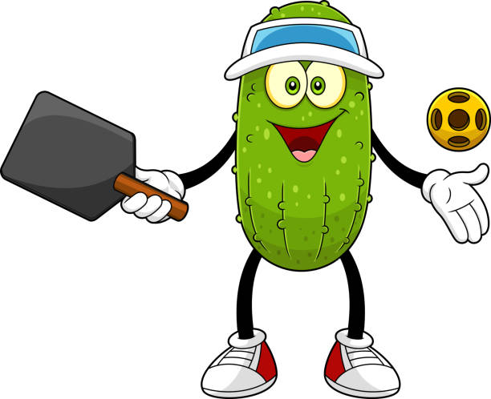

**Pickleball và những người bạn đã đi vào dĩ vãng**

Pickleball đến với tôi rất tự nhiên, giống như một buổi chiều rảnh rỗi vô tình cầm cây vợt lên rồi… không đặt xuống được nữa. Sân nhỏ, bóng nhẹ, luật đơn giản, nhưng cái làm tôi dính thật sự lại không nằm ở điểm số. Nó nằm ở tiếng cười, ở những pha đánh hụt “đi vào lòng đất”, và ở hai cái tên từng xuất hiện rất đều trong lịch chơi: Minh và Long.

{/* truncate */}

Minh là kiểu người lúc nào cũng tin rằng mình đánh rất “bài bản”. Cú giao bóng thì chậm rãi như đang suy nghĩ về triết lý cuộc đời, nhưng khi vào rally thì mọi lý thuyết tan biến. Minh hay đánh những quả bóng… không ai đoán trước được, kể cả chính Minh. Có những pha bóng bay sang sân đối thủ rất đẹp, nhưng cũng có những pha bay thẳng lên trời, để lại Minh đứng ngơ ngác như vừa đánh rơi một triết lý sống nào đó. Minh thua thì hay cười, thắng thì cũng cười, nói chung là lên sân để vui chứ không phải để thắng.

Long thì khác. Long vào sân với khí chất của một nhà vô địch tương lai. Khởi động kỹ, buộc dây giày cẩn thận, ánh mắt nghiêm túc. Nhưng cứ đến mấy pha gần lưới là Long lại đánh mạnh như đang chơi tennis, bóng bay qua sân đối thủ, qua luôn hàng rào, và đôi khi… qua cả niềm tin của đồng đội. Long đánh rất nhiệt, thua thì đổ tại gió, tại nắng, tại mặt sân, nhưng tuyệt nhiên không bao giờ tại mình.

Những buổi pickleball ngày đó không hẹn mà quen. Tan làm là nhắn nhau: “Ra sân không?” Không cần lịch, không cần lý do. Chỉ cần Minh mang theo nụ cười, Long mang theo tinh thần chiến đấu, và tôi mang theo niềm tin rằng hôm nay chắc chắn sẽ có chuyện để kể lại.

Rồi một ngày, lịch chơi thưa dần. Minh bận công việc mới, Long bận những dự định lớn hơn. Nhóm chat vẫn còn đó, nhưng tin nhắn thì nằm yên như trái bóng bị lăn vào góc sân. Tôi vẫn ra sân pickleball, vẫn đánh, vẫn vui, nhưng đôi khi trong một pha bóng chậm, tôi lại nhớ đến Minh với cú đánh “không theo trường phái nào”, nhớ Long với những cú smash thừa năng lượng.

Pickleball vẫn ở đó, sân vẫn vậy, nhưng những người bạn thì đã đi vào dĩ vãng – không mất đi, chỉ là chuyển sang một chương khác của cuộc đời. Và tôi biết, nếu một ngày nào đó Minh và Long quay lại, chỉ cần cầm vợt lên, mọi thứ sẽ lại quen thuộc như chưa từng có một khoảng cách nào.

Vì suy cho cùng, pickleball không chỉ là một môn thể thao. Nó là cái cớ để người ta gặp nhau, cười với nhau, và có những kỷ niệm đủ vui để sau này nhớ lại vẫn thấy… buồn cười.
